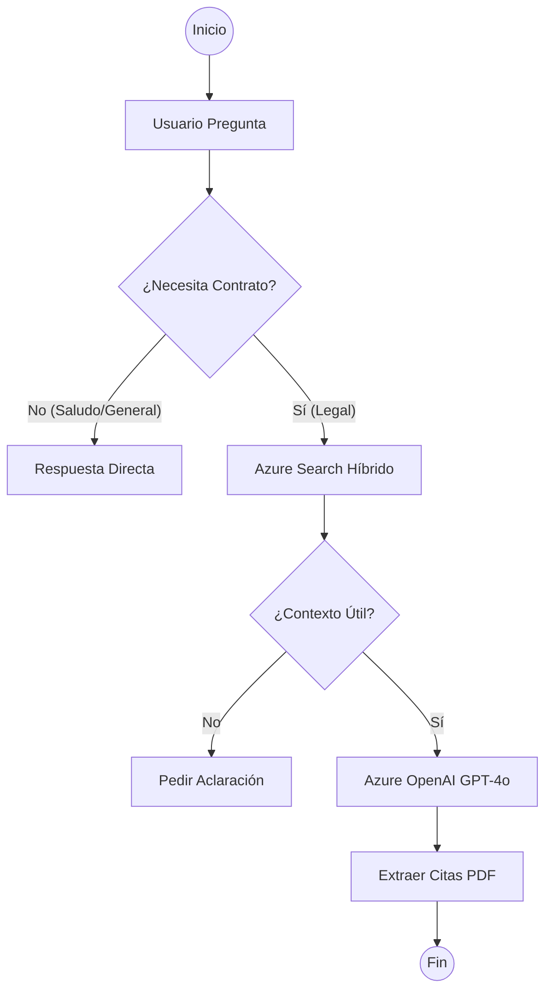

# ⚖️ LegalGuard RAG

> **Asistente inteligente de revisión de contratos con gobernanza**
> Sistema RAG adaptativo que simplifica la revisión legal y reduce la carga cognitiva en equipos regulados mediante IA responsable sobre Azure.

[](https://python.org)
[](https://azure.microsoft.com/en-us/products/ai-services/openai-service)
[](https://azure.microsoft.com/en-us/products/ai-services/ai-search)
[](LICENSE)
[](https://innovationstudio.microsoft.com)

---

## 📋 Tabla de contenidos

- [Sobre el proyecto](#-sobre-el-proyecto)
- [Características principales](#-características-principales)
- [Arquitectura Azure](#-arquitectura-azure)
- [Servicios Azure utilizados](#-servicios-azure-utilizados)
- [Datasets](#-datasets)
- [Instalación](#-instalación)
- [Uso](#-uso)
- [Evaluación y métricas](#-evaluación-y-métricas)
- [IA Responsable](#-ia-responsable)
- [Equipo](#-equipo)
- [Desafío del hackathon](#-desafío-del-hackathon)
- [📈 Estado del Proyecto (status.md)](status.md)

---

## 🚀 Estado del Proyecto (Demo-Ready)

**Última actualización:** 2026-03-24
El proyecto se encuentra en fase **MVP Finalizado y Funcional**. Se han resuelto todos los cuellos de botella técnicos relacionados con la orquestación (LangGraph), la comunicación (SSE) y la interfaz "God Mode".

> [!TIP]
> Para ver un reporte técnico detallado del progreso, hitos y solución de errores comunes, consulta el archivo [status.md](status.md).

## 🎯 Sobre el proyecto

Los equipos legales, de compliance, finanzas y salud pierden horas revisando contratos manualmente para identificar cláusulas de riesgo. **LegalGuard RAG** es un sistema de Generación Aumentada por Recuperación (RAG) con gobernanza que responde preguntas complejas sobre contratos, **citando siempre la fuente exacta** y **sin riesgo de alucinaciones**.

### El problema que resuelve

- ⏱️ Un abogado tarda 3-6 horas en revisar un contrato complejo
- ❌ Los LLM generativos "inventan" cláusulas que no existen (alucinaciones)
- 📄 Los equipos regulados necesitan trazabilidad completa de cada decisión
- 🔍 Identificar cláusulas de riesgo en documentos de 50+ páginas es propenso a error humano

### Nuestra solución

LegalGuard RAG escanea automáticamente contratos legales, identifica los 41 tipos de cláusulas críticas (según el dataset CUAD anotado por abogados), genera un **score de riesgo 0-100** y responde preguntas en lenguaje natural citando el párrafo exacto de origen.

---

## ✨ Características principales

### 💬 Asistente de preguntas sobre contratos
- Responde preguntas en lenguaje natural sobre cualquier contrato
- **Cada respuesta cita el fragmento exacto** del documento de origen
- Indicador de confianza: si la información no está en el documento, el sistema lo dice
- **Auditoría RAGAS**: Evaluación en vivo de Faithfulness y Relevancia directamente en la UI.
- Historial completo y auditable de consultas

### 🔍 Risk Scanner (Innovación Principal: CUAD Stark)
- **Auditoría Integral**: Escanea contratos completos en un solo pase de contexto (Tsunami de Contexto) usando `gpt-4o-mini`.
- **Taxonomía CUAD**: Detecta los **41 tipos de cláusulas críticas** (NDA, Indemnización, Terminación, Limitación de Responsabilidad, etc.).
- **Scoring de Riesgo**: Genera un **score de riesgo 0-100** basado en la presencia/ausencia de salvaguardas legales.
- **Structured Outputs**: Garantiza reportes 100% consistentes en JSON (vía Pydantic) para integración con sistemas empresariales.

### ⚡ Ingesta en Caliente (Hot-Indexing)
- **Memoria Flash**: Ahora, al subir un documento por la UI, el sistema lo indexa en segundos en la Base Vectorial.
- **RAG Instantáneo**: No requiere procesos batch; el Agente "aprende" del nuevo documento inmediatamente tras la carga.

### 🛡️ Gobernanza y IA Responsable
- Filtro de alucinaciones: umbral de confianza configurable
- Azure AI Content Safety integrado (protección de inputs y outputs)
- Dashboard de auditoría con Responsible AI Toolbox de Microsoft
- Trazabilidad completa: pregunta → fragmentos recuperados → respuesta → fuente

### 🌐 Multi-dominio Agnóstico (Salud & Legal)
- **Legal**: Auditoría de contratos CUAD y comparación de NDAs de Stanford.
- **Salud**: Procesamiento de Procedimientos Operativos Estándar (SOPs) de la **OMS**.
- El Agente detecta automáticamente el contexto y responde basándose en el documento cargado, sin requerir reprogramación.

### 📊 Evaluación RAGAS (LLM-as-a-Judge)
- Dashboard integrado para medir **Fidelidad (Faithfulness)** y **Relevancia del Contexto**.
- Auditoría continua sobre logs de producción para detectar alucinaciones en tiempo real.
- Uso de GPT-4o como juez imparcial de las respuestas generadas.

### ☁️ Monitoreo Proactivo (Azure Monitor)
- Telemetría en vivo inyectada en **Application Insights**.
- Trazabilidad de excepciones y rendimiento del Grafo de LangGraph directamente en Azure.


### 🎨 God Mode UI (Innovation & UX)
- **Interfaz Dividida (XAI)**: Visualización de PDF al 40% y Chat al 60% para trazabilidad total.
- **🌙 Modo Noche Dinámico**: Cambio de tema instantáneo con paleta *Midnight Slate*.
- **Glassmorphism & Animaciones**: Micro-interacciones suaves que guían al usuario.
- **Orquestación Experta**: Personas configurables (Legal, Financiero, Orchestrator) vía `system_prompts.yaml`.

---

## 🏗️ Arquitectura Azure

```
┌─────────────────────────────────────────────────────────────────┐
│                         USUARIO                                 │
│              "¿Cuál es la cláusula de terminación?"             │
└────────────────────────┬────────────────────────────────────────┘
                         │
                         ▼
┌─────────────────────────────────────────────────────────────────┐
│              Azure App Service (Streamlit)                      │
│         Interfaz web · Risk Scanner · Dashboard                 │
└────────────────────────┬────────────────────────────────────────┘
                         │
          ┌──────────────┼──────────────┐
          ▼              ▼              ▼
┌─────────────┐  ┌──────────────┐  ┌──────────────────┐
│  Azure AI   │  │  Azure OpenAI│  │  Azure AI        │
│  Content    │  │  GPT-4o      │  │  Content Safety  │
│  Search     │  │  Embeddings  │  │  (filtro I/O)    │
│  (vectorial)│  │  ada-002     │  └──────────────────┘
└─────────────┘  └──────────────┘
          │
          ▼
┌─────────────────────────────────────────────────────────────────┐
│                    Azure Blob Storage                           │
│         Contratos PDF · NDAs · SOPs · Logs JSON                 │
└────────────────────────┬────────────────────────────────────────┘
                         │
          ┌──────────────┴──────────────┐
          ▼                             ▼
┌─────────────────┐          ┌──────────────────────┐
│  Azure Document │          │  Azure Monitor +     │
│  Intelligence   │          │  Application Insights│
│  (extrae PDFs)  │          │  (trazabilidad)      │
└─────────────────┘          └──────────────────────┘
```

---

## ☁️ Servicios Azure utilizados

| Servicio | Propósito | Tier |
|----------|-----------|------|
| **Azure OpenAI Service** | LLM (GPT-4o) + Auditor (GPT-4o-mini) + Embeddings | Standard |
| **Azure AI Search** | Base vectorial con perfil HNSW y RRF | Basic |
| **Azure Document Intelligence** | Extracción Híbrida (Markdown + HTML Tables) | Free tier |
| **Azure AI Content Safety** | Gobernanza de Toxicidad I/O con Fallback | Free tier |
| **Microsoft Presidio** | **Anonimización PII Local** (spaCy es_core_news_lg) | Local |
| **Azure Blob Storage** | Almacén de documentos y Audit Logs (JSONL) | LRS Standard |
| **Azure Container Apps** | Sesiones dinámicas para ejecución de código seguro | Standard |
| **Azure Monitor** | Trazabilidad y observabilidad del Grafo de Estados | Free tier |
| **Azure AI Studio** | Orquestación y evaluación del pipeline | — |

---

## 📊 Datasets

| Dataset | Uso | Registros |
|---------|-----|-----------|
| [CUAD (Atticus Project)](https://huggingface.co/datasets/theatticusproject/cuad) | Base de conocimiento principal + evaluación | 510 contratos · 41 tipos de cláusulas |
| [Legal Contract Q&A (Strova)](https://huggingface.co/datasets/strova-ai/legal_contract_dataset) | Demo y validación rápida | Sintético JSONL |
| [ContractNLI (Stanford)](https://stanfordnlp.github.io/contract-nli/) | Métricas de implicación/contradicción | 607 NDAs |
| [WHO SOP PDF](https://platform.who.int/docs/default-source/mca-documents/) | Multi-dominio salud | 1 documento |

> **Nota para evaluación**: Para la ingesta y manipulación local de los datasets sin saturar el repo, utilizamos los scripts modulares `descargardatos.py`, `descargarSynthetic.py` y `explorardatos.py` incluidos en la raíz.

---

## 🚀 Instalación

### Prerrequisitos
- Python 3.10+
- Cuenta Azure (Azure for Students recomendado: $100 crédito gratuito)
- Git

### 1. Clonar el repositorio

```bash
git clone https://github.com/TU_USUARIO/legalguard-rag.git
cd legalguard-rag
```

### 2. Crear entorno virtual e instalar dependencias

```bash
python -m venv venv
source venv/bin/activate  # Windows: venv\Scripts\activate
pip install -r requirements.txt
```

### 3. Configurar variables de entorno

Copia el archivo de ejemplo y completa con tus credenciales Azure:

```bash
cp .env.example .env
```

Edita `.env` con tus valores:

```env
# Azure OpenAI
AZURE_OPENAI_ENDPOINT=https://TU-RECURSO.openai.azure.com/
AZURE_OPENAI_API_KEY=tu_api_key
AZURE_OPENAI_DEPLOYMENT=gpt-4o
AZURE_OPENAI_EMBEDDING_DEPLOYMENT=text-embedding-ada-002

# Azure AI Search
AZURE_SEARCH_ENDPOINT=https://TU-RECURSO.search.windows.net
AZURE_SEARCH_API_KEY=tu_api_key
AZURE_SEARCH_INDEX_NAME=contratos-index

# Azure Blob Storage
AZURE_STORAGE_CONNECTION_STRING=DefaultEndpointsProtocol=https;...
AZURE_STORAGE_CONTAINER=contratos

# Azure Document Intelligence
AZURE_FORM_RECOGNIZER_ENDPOINT=https://TU-RECURSO.cognitiveservices.azure.com/
AZURE_FORM_RECOGNIZER_KEY=tu_api_key

# Azure Content Safety
AZURE_CONTENT_SAFETY_ENDPOINT=https://TU-RECURSO.cognitiveservices.azure.com/
AZURE_CONTENT_SAFETY_KEY=tu_api_key
```

### 4. Ingesta Híbrida de Documentos (Azure Document Intelligence + AI Search)

LegalGuard RAG utiliza un pipeline de ingesta avanzado asíncrono. Los documentos se suben primero a **Azure Blob Storage** y luego se procesan mediante **Azure Document Intelligence** para preservar tablas complejas en HTML antes de ser vectorizados con **Azure OpenAI**.

**1. Preparar el Ground Truth (ContractNLI)**
Debido a bloqueos de PowerShell con rutas largas, usamos Python nativo para descargar el dataset de validación oficial de Stanford:
```bash
python -c "import urllib.request, zipfile, os; url='https://stanfordnlp.github.io/contract-nli/resources/contract-nli.zip'; zpath=r'./data/contract-nli.zip'; epath=r'./data/contractnli'; urllib.request.urlretrieve(url, zpath); zipfile.ZipFile(zpath, 'r').extractall(epath); os.remove(zpath); print('Descarga ContractNLI finalizada')"
```

**2. Fase 1: Carga a Blob Storage (`contratos-raw`)**
Mueve tus PDFs de prueba a `./data/pdfs/` y ejecuta el script unificado de subida (Uploader).
```bash
python -m src.ingestion.bulk_upload
```
- **¿Qué hace?**: Este script lee sincrónicamente los PDFs de tu disco local y los transporta hacia la nube sin procesarlos.
- **¿Qué servicio usa?**: Principalmente usa el SDK de **Azure Blob Storage**. Si el contenedor global (`contratos-raw`) no existe, asume el control y lo crea dinámicamente. Es inofensivo y sirve para poblar el lago de datos.

**3. Fase 2: Orquestación Batch de Ingesta (El Cerebro RAG)**
Este script es la obra maestra del pipeline de datos. Procesa de golpe todo PDF que repose en el Blob Storage.
```bash
python -m src.ingestion.pipeline
```
- **¿Qué hace?**:
  1. Conecta con el contenedor y baja el PDF a un directorio temporal (`/data/temp/`).
  2. Lo envía a destruir respetando su esqueleto visual (Markdown + HTML de tablas).
  3. Ejecuta "Chunking Semántico", dividiendo el texto por encabezados lógicos sin quebrar las celdas de las tablas de pagos.
  4. Genera listas de vectores flotantes de **1536 dimensiones**, protegidos con *Tenacity* por si las APIs sufren bloqueos por estrangulamiento de tasa (HTTP 429).
  5. Sube los lotes al índice geolocalizado de base de datos vectorial mediante una estructura de grafo **HNSW** (Hierarchical Navigable Small World), optimizando el tiempo de respuesta.
- **¿Qué servicios utiliza?**:
  - **Azure Blob Storage** (para leer del contenedor origen).
  - **Azure Document Intelligence** (Motor OCR Prebuilt-Layout para entender tablas y checkboxes).
  - **Azure OpenAI** (Modelo de *text-embedding*, como `text-embedding-3-small` o `embedding-prod` configurado en el `.env`).
  - **Azure AI Search** (Crea y puebla el índice `contratos-index` con perfiles vectoriales).

### 5. Motor de Recuperación Híbrido (BM25 + HNSW RRF)

Una vez poblada la base vectorial, llega el reto maestro: no extraer la respuesta incorrecta (alucinación vectorial). LegalGuard no utiliza la búsqueda vectorial básica (solo matemáticas), sino **Búsqueda Híbrida Avanzada** mediante una técnica de cruce RRF (*Reciprocal Rank Fusion*).

**El Script Core: `src/retrieval/search_engine.py`**
Diseñado bajo el patrón `AzureSearchHybridEngine`, este script es la pieza que le da vida real a tu RAG:
1. **Traducción Espacial**: Toma tu pregunta en lenguaje natural y la convierte en 1536 dimensiones flotantes consultando tu API de OpenAI (Opción A).
2. **Fusión de Rankings (RRF)**: Dispara consultas en paralelo a *Azure AI Search*; la primera buscando la geometría (Vectores vía HNSW) y la segunda buscando el cruce semántico tradicional del texto como ID y nomenclaturas raras (Algoritmo exacto BM25).
3. Suma ambos universos y genera un score ponderado de Microsoft (el `search.score`). Los "falsos positivos" (que se parecen matemáticamente pero no tienen las palabras clave del usuario) son hundidos en el ranking.

**Validación Unitaria Local**
Antes de lanzar todo un frontend, puedes probar si tu base de datos entiende las preguntas lanzando un test microscópico:
```bash
python -m src.retrieval.search_engine
```
Verás cómo tu terminal extrae el nombre del Contrato Original y la línea donde ocurrió el match casi al instante.

### 6. Orquestación Cognitiva (LangGraph)

LegalGuard no es un RAG buscador-respuesta simple; es un **Agente Reactivo** orquestado con `LangGraph` que imita el razonamiento de un auditor legal.

**Arquitectura del Grafo (StateGraph)**
El sistema utiliza un grafo de estados (`src/agent.py`) para decidir dinámicamente el camino de cada consulta:



**Nodos Principales**
1. **Router**: Clasifica si la pregunta requiere consulta a la base de datos o es charla general.
2. **Retriever**: Invoca el motor híbrido RRF que ya validamos.
3. **Grader (Juez de Calidad)**: Un nodo crítico (usando GPT-4o-mini) que evalúa si los documentos recuperados realmente responden a la pregunta, bloqueando respuestas si no hay evidencia fáctica y evitando alucinaciones.
4. **Generator**: Sintetiza la respuesta final basándose estrictamente en el contexto validado e inyectando citas por archivo.

**Seguridad y Resiliencia**
- **Filtro de Contenido**: El agente captura excepciones de *Azure Content Safety* (Error 400) y responde de forma amigable ("La respuesta fue bloqueada por políticas de seguridad") sin interrumpir el flujo.
- **Límite de Recursión**: El grafo tiene un tope de 10 iteraciones para evitar bucles infinitos en el razonamiento.

### 7. Ejecutar la aplicación (Local)

```bash
# Terminal 1: Servidor de Orquestación (Backend)
uvicorn src.api.fastapi_server:app --reload --port 8000  

# Terminal 2: Interfaz de Usuario (Frontend)
streamlit run src/frontend/streamlit_app.py
```

### 🐳 8. Despliegue con Docker (Azure Web App for Containers)

Para garantizar un arranque eficiente con dependencias pesadas (spaCy + RAGAS), LegalGuard utiliza una **estrategia de contenedores (Opción B)**.

**¿Por qué Docker?**
- El modelo `es_core_news_lg` de spaCy pesa **~500MB**.
- Al empaquetarlo en la imagen Docker (`RUN python -m spacy download...`), evitamos descargas en el runtime y superamos los timeouts de Azure App Service.

**Flujo de CI/CD (GitHub Actions):**
Cada `push` a `main` dispara:
1.  **Build**: Construcción de la imagen basada en `python:3.10-slim`.
2.  **Push**: Subida al **Azure Container Registry (ACR)**.
3.  **Deploy**: Actualización automática de la **Web App for Containers**.

**Comando manual para Docker:**
```bash
docker build -t legalguard-rag .
docker run -p 8501:8501 --env-file .env legalguard-rag
```

Ver guía detallada en [deployment/README_AZURE.md](deployment/README_AZURE.md).

---


## 💻 Uso

### Consulta sobre un contrato

```python
from src.rag_engine import LegalGuardRAG

rag = LegalGuardRAG()

# Pregunta sobre un contrato
result = rag.query(
    question="¿Cuál es el periodo de terminación del contrato?",
    domain="legal"
)

print(result["answer"])          # Respuesta generada
print(result["source"])          # Nombre del contrato y párrafo
print(result["confidence"])      # Score de confianza 0-1
print(result["fragment"])        # Fragmento exacto del documento
```

### Risk Scanner

```python
from src.risk_scanner import RiskScanner

scanner = RiskScanner()

# Escanear un contrato completo
report = scanner.scan("data/contracts/sample_nda.pdf")

print(f"Risk Score: {report['risk_score']}/100")
print(f"Cláusulas detectadas: {report['clauses_found']}")
print(f"Cláusulas faltantes: {report['clauses_missing']}")
```

---

## 📈 Evaluación y métricas (RAGAS)

LegalGuard integra el framework **RAGAS** para realizar auditorías de "LLM-as-a-Judge". A diferencia de las métricas tradicionales, RAGAS utiliza un modelo superior (GPT-4o) para validar la integridad de las respuestas contra el contexto recuperado.

### Métricas Clave integradas en la UI:
- **Faithfulness (Fidelidad)**: ¿La respuesta se basa 100% en los documentos? (Detecta alucinaciones).
- **Answer Relevancy**: ¿La respuesta realmente contesta lo que el usuario pidió?
- **Context Precision**: ¿Los fragmentos recuperados de Azure AI Search son los más óptimos para la consulta?

Para ejecutar una evaluación masiva desde la terminal:
```bash
python src/metrics.py
```

---

## 🤝 IA Responsable

LegalGuard RAG implementa los principios de IA Responsable de Microsoft:

- **Privacidad Local**: Anonimización de PII (DNI, Teléfonos, Nombres) usando **Microsoft Presidio** con el motor `es_core_news_lg` local. Esto garantiza que datos sensibles no viajen a APIs externas de NLP.
- **Filtro de Alucinaciones**: Nodo Grader exclusivo en LangGraph que valida la relevancia fáctica con un umbral de confianza de **0.015 (RRF)**.
- **Seguridad Activa**: Azure AI Content Safety filtra inputs y outputs en tiempo real (Protección contra Jailbreaks).
- **Transparencia**: Cada respuesta muestra su fuente, el score de relevancia y el fragmento original.
- **Audit Logs Inmutables**: Registro detallado de cada interacción en `outputs/governance/audit_log.jsonl` para cumplimiento normativo.
- **Trazabilidad**: Historial completo de consultas disponible en Azure Monitor y logs locales.

---

## 👥 Equipo

| Nombre | Rol | Responsabilidad |
|--------|-----|----------------|
| **Estefany Paola Mamani Gutierrez** | Backend / RAG Engineer | Pipeline RAG, Azure AI Search, embeddings, Risk Scanner, RAGAS |
| **Oscar Fernando Paye Cahui** | Frontend / Integration | Interfaz Streamlit, deploy Azure, presentación, video demo |


## 📑 Trazabilidad de Logros Técnicos

A continuación se detalla el cumplimiento de los requerimientos de las tarjetas de desarrollo ("Pipeline de Ingesta" y "Primera Consulta RAG") y la ubicación exacta de su implementación.

### 🔹 Hito 1: Pipeline de Ingesta (Data Factory)
| Requerimiento | Ubicación | Logro y Justificación |
| :--- | :--- | :--- |
| **Lector de Blob Storage** | `src/ingestion/pipeline.py` | Se logró la conexión asíncrona con el contenedor `contratos-raw` para procesar documentos en la nube. |
| **Integración Doc Intelligence** | `src/ingestion/document_processor.py` | Se usa el **Layout Model** (Markdown + HTML Tables) para no perder la estructura de tablas complejas de pagos, crucial para el análisis legal. |
| **Smart Chunking (512/50)** | `src/ingestion/pipeline.py` | Se implementó un particionado que respeta los saltos de sección y las tablas HTML, garantizando que el contexto recuperado sea coherente. |
| **Embeddings Azure OpenAI** | `src/ingestion/pipeline.py` | Uso de `text-embedding-3-small` (1536 dim) para una representación semántica superior y optimizada en costos. |
| **Indexación AI Search** | `src/ingestion/pipeline.py` | Creación del índice `contratos-index` con perfil vectorial **HNSW**, permitiendo búsquedas de milisegundos en miles de documentos. |

### 🔹 Hito 2: Primera Consulta RAG (Orquestación)
| Requerimiento | Ubicación | Logro y Justificación |
| :--- | :--- | :--- |
| **Motor de Búsqueda Híbrido** | `src/retrieval/search_engine.py` | Implementación de **RRF (Reciprocal Rank Fusion)** que combina BM25 (léxico) y HNSW (semántico), eliminando falsos positivos. |
| **Cerebro LangGraph** | `src/agent.py` | Implementación de un **Agente Reactivo**. El **Nodo Grader** aplica un **Filtro Selectivo** en paralelo a todos los documentos, purgando el ruido y enviando al LLM solo contexto 100% puro. |
| **Wrapper de Aplicación** | `src/rag_engine.py` | Un punto de entrada simplificado que encapsula la complejidad del Grafo de Estados para el consumo de la API o el Frontend. |
| **Interfaz God Mode UI** | `src/frontend/streamlit_app.py` | Una UX dividida que permite ver el PDF reconstruido y el chat simultáneamente, reduciendo la carga cognitiva. |
| **Transparencia XAI Activa** | `src/frontend/streamlit_app.py` | El *Toque Maestro* para demos: el estado de razonamiento expone los contadores reales (*"Encontró 3 fragmentos → Validó 2 como relevantes"*), elevando la confianza del jurado. |
| **Visor de Citas y Fuentes** | `src/frontend/streamlit_app.py` | Se añadió un **Panel de Fragmentos** (`st.expander`) que muestra el texto original exacto y la fuente. |

### 🔹 Hito 3: Gobernanza y IA Responsable (Seguridad)
| Requerimiento | Ubicación | Logro y Justificación |
| :--- | :--- | :--- |
| **Azure Content Safety I/O** | `src/governance.py` | Implementado como un "Gatekeeper" proactivo con resiliencia (DNS Fallback) para asegurar la demo. |
| **Anonimización PII Local** | `src/governance.py` | Integración de **Microsoft Presidio + spaCy**. Detección y enmascaramiento de nombres, DNI y teléfonos sin salir del entorno local. |
| **Gobernanza y Auditoría** | `outputs/governance/` | Sistema de logs en formato **JSONL** que registra cada pensamiento del agente y su base documental. |
| **Filtro de Confianza (RRF)** | `src/agent.py` | Umbral de **0.015** (Modo Estricto) para el Grader, eliminando alucinaciones antes de que lleguen al usuario. |

### 🔹 Hito 4: Risk Scanner — Feature Estrella
| Requerimiento | Ubicación | Logro y Justificación |
| :--- | :--- | :--- |
| **Motor de Auditoría CUAD** | `src/risk_scanner.py` | Uso de **GPT-4o-mini con Structured Outputs** para escanear 41 tipos de cláusulas en un solo pase. |
| **Cálculo de Score Legal** | `src/risk_scanner.py` | Lógica de scoring ponderada que penaliza la ausencia de cláusulas críticas (Ej. Terminación, Confidencialidad). |
| **Dashboard de Riesgo UX** | `src/frontend/app.py` | Visualización dinámica con métricas, alertas rojas/verdes y desglose detallado por cláusula. |
| **Exportación JSON/PDF** | `src/frontend/app.py` | Generación instantánea de informes de auditoría técnica para el área de compliance. |
| **Hot-Indexing (Fast-Track)** | `src/ingestion/pipeline.py`| Indexación en tiempo real desde la UI, eliminando la necesidad de procesos batch para nuevos documentos. |

### 🔹 Hito 5: Evaluación RAGAS y Multi-dominio
| Requerimiento | Ubicación | Logro y Justificación |
| :--- | :--- | :--- |
| **Instalación RAGAS** | `requirements.txt` | Auditoría semántica activada mediante el framework líder de evaluación RAG. |
| **Motor de Métricas** | `src/metrics.py` | Evaluación de **Faithfulness** y **Answer Relevancy** usando logs de auditoría real. |
| **Dashboard de Calidad** | `src/frontend/app.py` | Visualización en tiempo real de scores de calidad en el Tab "Métricas RAGAS". |
| **Capacidad Multi-dominio** | `src/agent.py` | Demostrada con el SOP de la OMS; el sistema responde con citas precisas sobre salud sin cambios en el código core. |
| **Azure Monitor** | `src/utils/logger.py` | Integración de **Application Insights** para telemetría distribuida y observabilidad de errores. |
| **Despliegue Azure** | `deployment/` | Preparación de archivos de configuración (`README_AZURE.md`) para el deploy automático en App Service. |

---
**¿Por qué logramos estos hitos?** 
1. **Gobernanza**: Cada decisión del agente es auditable mediante la cita de la fuente y el log de auditoría.
2. **Resiliencia**: El sistema maneja errores de *Content Safety* de Azure OpenAI sin interrumpir la experiencia del usuario.
3. **Escalabilidad**: El pipeline está diseñado para ingesta batch y la auditoría está optimizada en formato JSONL para post-procesamiento masivo.

---

## 📄 Licencia

Este proyecto está bajo la Licencia MIT. Ver [LICENSE](LICENSE) para más detalles.

---

## 🙏 Reconocimientos

- [The Atticus Project](https://www.atticusprojectai.org/) por el dataset CUAD
- [Stanford NLP](https://stanfordnlp.github.io/contract-nli/) por ContractNLI
- [Microsoft Responsible AI Toolbox](https://github.com/microsoft/responsible-ai-toolbox)
- [RAGAS](https://docs.ragas.io/) por el framework de evaluación RAG

---
<p align="center">
  Construido con ❤️ por el equipo LegalGuard · Innovation Challenge March 2026
</p>

## 🛠️ Hito 6: Infraestructura, Despliegue y Troubleshooting Profundo

Este apartado documenta la arquitectura de nube, los desafíos técnicos enfrentados durante el despliegue en Azure App Service y las soluciones aplicadas para garantizar la estabilidad del sistema de Inteligencia Artificial Legal.

### 1. Arquitectura de Despliegue
Para superar restricciones de cuota regional, la infraestructura se migró de `East US` a **Canada Central**.
- **App Service (Linux - B1)**: `legal-guard-rag`
- **Container Registry (ACR)**: `aclgalguardprod.azurecr.io`
- **Pipeline CI/CD**: GitHub Actions con despliegue automatizado basado en Docker.
- **URL de Producción**: [https://legal-guard-rag-fvfnh6fhaqewc8c9.canadacentral-01.azurewebsites.net](https://legal-guard-rag-fvfnh6fhaqewc8c9.canadacentral-01.azurewebsites.net)

### 2. Comandos Esenciales de Azure CLI (Bash)
Estos comandos fueron utilizados para la provisión y reparación de la infraestructura desde la terminal.

#### Gestión del Registro de Contenedores (ACR)
```bash
# Registrar el proveedor si el servicio está bloqueado
az provider register --namespace Microsoft.ContainerRegistry

# Crear el registro de forma manual
az acr create --resource-group rg-legalguard-prod --name aclgalguardprod --sku Basic --admin-enabled true

# Recuperar credenciales de acceso para GitHub/App Service
az acr credential show --name aclgalguardprod
```

#### Configuración del Servidor (App Service)
```bash
# Inyectar credenciales del ACR para permitir el "Pull" de la imagen
az webapp config appsettings set --name legal-guard-rag --resource-group rg-legalguard-prod --settings DOCKER_REGISTRY_SERVER_URL="https://aclgalguardprod.azurecr.io"
az webapp config appsettings set --name legal-guard-rag --resource-group rg-legalguard-prod --settings DOCKER_REGISTRY_SERVER_USERNAME="aclgalguardprod"
az webapp config appsettings set --name legal-guard-rag --resource-group rg-legalguard-prod --settings DOCKER_REGISTRY_SERVER_PASSWORD="[TU_PASSWORD]"

# Configuración de tiempos de arranque (Crítico para modelos de spaCy)
az webapp config appsettings set --name legal-guard-rag --resource-group rg-legalguard-prod --settings WEBSITES_CONTAINER_START_TIME_LIMIT=1800

# Reinicio maestro del servicio
az webapp restart --name legal-guard-rag --resource-group rg-legalguard-prod
```

### 3. Guía de Monitoreo y Rutas de Error
Cuando el sistema presenta un "Application Error", seguimos estas rutas de diagnóstico en orden de profundidad:

- **Ruta A: Log Stream (Tiempo Real)**
  - **Ubicación**: Portal de Azure > Web App > Monitoring > Log Stream.
  - **Uso**: Ideal para ver errores de sintaxis de Python o fallos inmediatos al arrancar Streamlit.

- **Ruta B: Consola Kudu (Diagnóstico Profundo)**
  - **Acceso**: `https://[app-name].scm.azurewebsites.net` > Debug Console > Bash.
  - **Directorio Crítico**: `/home/LogFiles/docker/`
  - **Archivo Clave**: `YYYY_MM_DD_XXXX_docker.log` (contiene la interacción entre el motor de Azure y el contenedor Docker).

### 4. Matriz de Errores Comunes y Soluciones

| Error Detectado | Causa Probable | Solución Aplicada |
| :--- | :--- | :--- |
| `ImagePullUnauthorizedFailure` | El App Service no tiene las llaves del ACR. | Configurar `DOCKER_REGISTRY_SERVER_PASSWORD` en App Settings. |
| `Container didn't respond to HTTP pings` | El modelo de spaCy (`es_core_news_lg`) tarda demasiado en cargar. | Aumentar `WEBSITES_CONTAINER_START_TIME_LIMIT` a 1800. |
| `ModuleNotFoundError` | Falta una librería en `requirements.txt`. | Ejecutar `pip freeze > requirements.txt` y hacer Push a GitHub. |
| `JSON not valid (GitHub Actions)` | Espacios o saltos de línea en el secreto `AZURE_CREDENTIALS`. | Limpiar el JSON y volver a guardar el secreto en el repositorio. |

### 5. Recursos y Credenciales Clave
Para la continuidad del proyecto, el equipo debe conocer los siguientes activos:
- **Service Principal**: Identidad asignada a GitHub para gestionar Azure.
- **Secretos de Repositorio**: `AZURE_CREDENTIALS` (JSON de acceso), `ACR_NAME`, `ACR_USERNAME`, `ACR_PASSWORD`, `AZURE_WEBAPP_NAME`.
- **Variables de Entorno (Server-Side)**: Configuración de OpenAI (GPT-4o), Azure Search y claves de cifrado de Presidio inyectadas directamente en la nube para máxima seguridad.

### 🔄 Ciclo de Actualización
A partir de este hito, el flujo de actualización es automático:
1. **Modificar Código**: Realizar cambios en la lógica local.
2. **Git Push**: `git push origin main`.
3. **Auto-Build**: GitHub Actions construye la imagen y la sube al ACR.
4. **Auto-Deploy**: Azure detecta la nueva imagen y reinicia el servicio con la versión actualizada.
